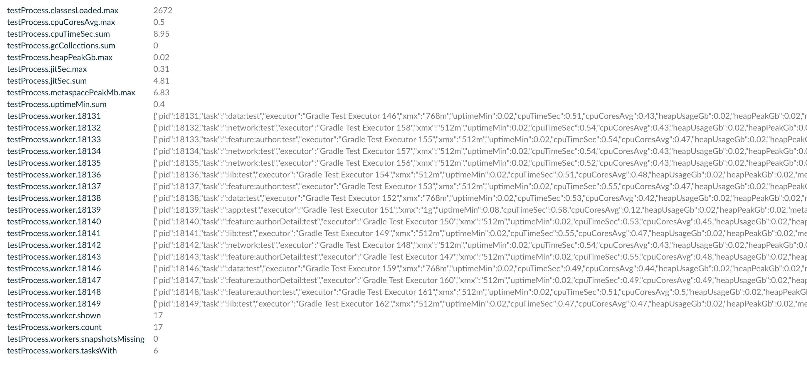

# Info Test Process Plugin

Captures per-worker JVM metrics for every Gradle test fork in your build and publishes
them as Build Scan® custom values, ready for inspection in the scan UI or aggregation
in Develocity Analytics (DRV).

For each test worker JVM the plugin records:

- **Identity** — task path, executor name, configured `-Xmx`, JVM args, start time, PID
- **CPU** — total CPU time (`cpuTimeSec`) and average cores busy (`cpuCoresAvg`)
- **Memory** — heap usage at shutdown, peak heap across pools, peak metaspace
- **GC** — collector type (G1 / Parallel / Z / Shenandoah / CMS / Serial), collection count, total GC time
- **JIT** — total compilation time
- **Class loading** — total classes loaded
- **Threads** — peak thread count

> [!NOTE]
> Since version 1.0.0 the plugin is applied in `settings.gradle(.kts)`.

## Usage

Apply the plugin in your main `settings.gradle(.kts)`:

```kotlin
plugins {
    id("io.github.cdsap.testprocess") version "2.0.0"
}
```

That's it. The plugin attaches to every `Test` task in the build and produces output
in two modes:

| Mode | Output |
|---|---|
| Develocity applied | Custom values + scan tags published to the Build Scan |
| No Develocity | Structured JSON file at `${rootDir}/statsTestTasks.json` |

## Output

### Build Scan custom values

#### Summary scalars (indexable in DRV)

| Key | Description |
|---|---|
| `testProcess.workers.count` | Number of test worker JVMs registered |
| `testProcess.workers.tasksWith` | Number of distinct test tasks that ran |
| `testProcess.workers.snapshotsMissing` | Workers that didn't write a stats snapshot (health signal) |
| `testProcess.worker.shown` | Workers whose detail blob was emitted (== count unless truncated) |
| `testProcess.cpuCoresAvg.max` | Highest `cpuTime / uptime` across all workers (>1 = multi-core utilization) |
| `testProcess.cpuTimeSec.sum` | Total CPU time across all workers |
| `testProcess.heapPeakGb.max` | Highest per-worker peak heap usage |
| `testProcess.metaspacePeakMb.max` | Highest per-worker peak metaspace |
| `testProcess.jitSec.sum` | Total JIT compilation time across workers |
| `testProcess.jitSec.max` | Worst single-worker JIT time |
| `testProcess.classesLoaded.max` | Largest classloader footprint |
| `testProcess.gcCollections.sum` | Total GC collections across workers |
| `testProcess.uptimeMin.sum` | Total worker wall-clock time |

#### Per-worker detail

One custom value per worker, key = `testProcess.worker.<pid>`, value = JSON:

```json
{
  "pid": 13402,
  "task": ":core:domain:testDemoDebugUnitTest",
  "executor": "Gradle Test Executor 5",
  "xmx": "512m",
  "uptimeMin": 0.02,
  "cpuTimeSec": 3.05,
  "cpuCoresAvg": 3.31,
  "heapUsageGb": 0.14,
  "heapPeakGb": 0.14,
  "metaspacePeakMb": 14.54,
  "gcType": "G1",
  "gcCollections": 2,
  "gcTimeSec": 0.0,
  "jitSec": 2.28,
  "classesLoaded": 3503,
  "peakThreads": 10,
  "statsSnapshotMissing": false
}
```

If a build exceeds Develocity's 1,000-unique-values-per-scan cap (i.e. >950 workers),
the heaviest workers by `cpuTimeSec` are kept and the plugin emits
`testProcess.worker.truncated=true` plus `testProcess.worker.total=<count>` so you
know data was dropped.

#### Scan tags

Categorical filters for fast slicing in DRV. Fired automatically when thresholds hit:

| Tag | When |
|---|---|
| `tests:cpu-heavy` | Any worker `cpuCoresAvg > 4.0` |
| `tests:near-oom` | Any worker `heapPeak / xmx ≥ 0.8` |
| `tests:jit-bound` | Any worker `jitSec / cpuTimeSec ≥ 0.5` and `jitSec ≥ 1.0` |
| `tests:no-snapshot` | One or more workers didn't write a stats snapshot |

### File output (no Develocity)

Without Develocity, the same data is written to `${rootDir}/statsTestTasks.json` as
a single nested document with `summary` / `byTask` / `workers` / `tags`:

```json
{
  "summary": {
    "workers": {
      "count": 1,
      "tasksWith": 1,
      "snapshotsMissing": 0
    },
    "cpuCoresAvgMax": 2.41,
    "cpuTimeSecSum": 0.42,
    "heapPeakGbMax": 0.02,
    "metaspacePeakMbMax": 7.2,
    "jitSecSum": 0.2,
    "jitSecMax": 0.2,
    "classesLoadedMax": 2711,
    "gcCollectionsSum": 0,
    "uptimeMinSum": 0.0
  },
  "byTask": {
    ":test": {
      "workers": 1,
      "cpuCoresAvgMax": 2.41,
      "cpuTimeSecSum": 0.42,
      "heapPeakGbMax": 0.02,
      "jitSecMax": 0.2,
      "classesLoadedMax": 2711,
      "peakThreadsMax": 9
    }
  },
  "workers": [
    {
      "pid": 20910,
      "task": ":test",
      "executor": "Gradle Test Executor 24",
      "xmx": "512m",
      "uptimeMin": 0.0,
      "cpuTimeSec": 0.42,
      "cpuCoresAvg": 2.41,
      "heapUsageGb": 0.02,
      "heapPeakGb": 0.02,
      "metaspacePeakMb": 7.2,
      "gcType": "G1",
      "gcCollections": 0,
      "gcTimeSec": 0.0,
      "jitSec": 0.2,
      "classesLoaded": 2711,
      "peakThreads": 9,
      "statsSnapshotMissing": false
    }
  ],
  "tags": []
}
```

`byTask` is intentionally *not* emitted on the scan — it's derivable from the per-PID
values via DRV (see below) and would duplicate data against the per-scan value cap.
It is included in the file output because the file isn't subject to scan limits and
the precomputed summary aids local inspection.

## Querying from Develocity Analytics (DRV)

### Find builds with heavy workers

```sql
SELECT build_id
FROM gradle_attributes_custom_values
WHERE name = 'testProcess.cpuCoresAvg.max'
  AND CAST(value AS DECIMAL) > 4;
```

### Reconstruct per-task aggregates on the fly

```sql
SELECT
  JSON_VALUE(value, '$.task')                  AS task,
  COUNT(*)                                     AS workers,
  MAX(JSON_VALUE(value, '$.cpuCoresAvg'))      AS cpu_cores_max,
  SUM(JSON_VALUE(value, '$.cpuTimeSec'))       AS cpu_time_sum,
  MAX(JSON_VALUE(value, '$.heapPeakGb'))       AS heap_peak_max,
  MAX(JSON_VALUE(value, '$.jitSec'))           AS jit_max
FROM gradle_attributes_custom_values
WHERE build_id = '<scan-id>'
  AND name LIKE 'testProcess.worker.%'
  AND name NOT IN (
    'testProcess.worker.shown',
    'testProcess.worker.truncated',
    'testProcess.worker.total'
  )
GROUP BY task;
```

### Filter to "cpu-heavy or jit-bound" builds

```sql
SELECT build_id FROM builds WHERE tags && ARRAY['tests:cpu-heavy', 'tests:jit-bound'];
```

## How it works

The plugin uses a small Java agent (~5 KB, no runtime dependencies) that is injected
into every Gradle test worker JVM via `-javaagent:`. The agent:

1. On JVM startup (`premain`), reads a sentinel system property to learn its task
   path and writes a JSON identity file to a known directory.
2. On JVM shutdown, reads `RuntimeMXBean` / `MemoryMXBean` / `GarbageCollectorMXBean`
   / `OperatingSystemMXBean` / `CompilationMXBean` / `ClassLoadingMXBean` /
   `ThreadMXBean` and writes a stats snapshot to the same directory.

At the end of the build, the plugin reads those files, joins identity with stats by
PID, and publishes the data. This avoids:

- The race conditions of polling `ProcessHandle.descendants()` from the daemon
- External `jstat` shell-outs (and the `bash`/Windows portability headaches)
- Misattribution from parsing JVM `tmpdir` paths to guess task identity

The agent itself runs in the worker JVM and has no Kotlin / kotlinx dependency —
it adds nothing to the worker's bootclasspath beyond a single ~5 KB class file.

## Configuration cache compatibility

| Mode | Status |
|---|---|
| `--configuration-cache` (basic) | ✅ Stored on first build, reused on subsequent builds |
| `--configuration-cache-problems=fail` (strict) | ✅ No problems reported |
| `-Dorg.gradle.unsafe.isolated-projects=true` (Isolated Projects) | ✅ |
| Gradle 8.x, 9.x | ✅ Both verified in the integration test suite |

The plugin does no filesystem I/O at apply time — agent jar extraction and registry
directory setup are deferred to a `BuildService` `init` block, which runs at task
execution time (after CC restoration).

## Requirements

- Gradle 8 or later
- Test workers running JDK 17 or later (the bundled Java agent is compiled to Java 17 bytecode)
- Optional: Develocity, if you want the data on Build Scans


