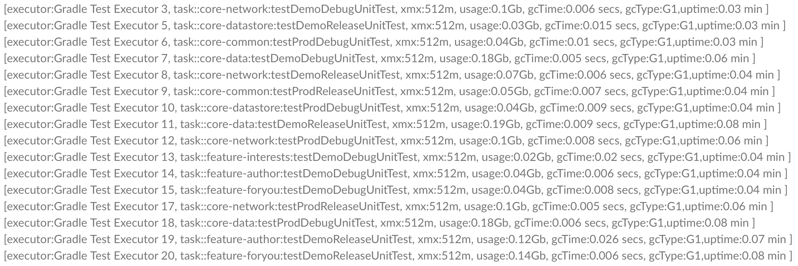

# Info Test Process Plugin
Includes information about Test processes in the Build Scans.
The plugin is compatible with configuration cache.

## Usage
Apply the plugin in the main `build.gradle(.kts)` configuration file:

#### Kotlin
Using the plugins DSL:
``` groovy
plugins {
  id("io.github.cdsap.testprocess") version "0.1.4"
}
```

Using legacy plugin application:
``` groovy
buildscript {
  repositories {
    gradlePluginPortal()
  }
  dependencies {
    classpath("io.github.cdsap:testprocess:0.1.4")
  }
}

apply(plugin = "io.github.cdsap.testprocess")
```

#### Groovy
Using the plugins DSL:
``` groovy
plugins {
  id "io.github.cdsap.testprocess" version "0.1.4"
}

```

Using legacy plugin application:
``` groovy
buildscript {
  repositories {
    gradlePluginPortal()
  }
  dependencies {
    classpath "io.github.cdsap:testprocess:0.1.4"
  }
}

apply plugin: "io.github.cdsap.testprocess"
```
## Output
### Build Scans
If you are using Gradle Enterprise, the information:
* Total number of processes created
* Processes by task
* Information about the process




## Requirements
* Gradle 7.5
* Gradle Enterprise

## Libraries
* com.gradle.enterprise:com.gradle.enterprise.gradle.plugin
